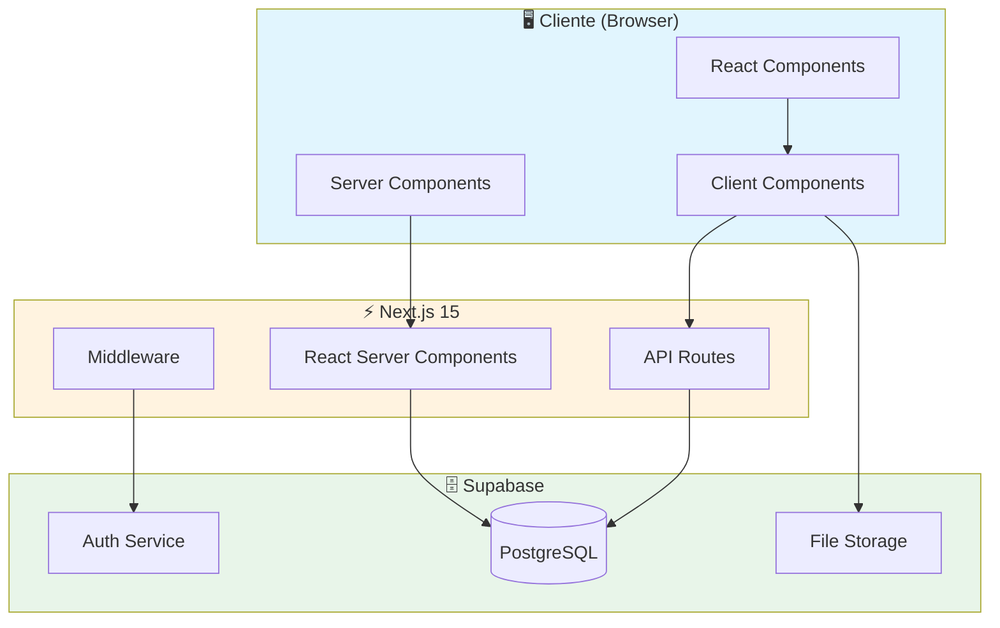
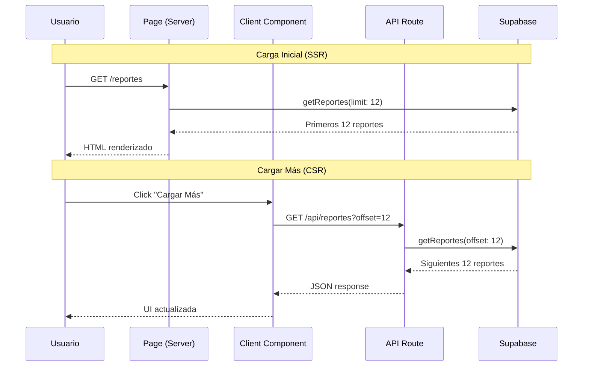
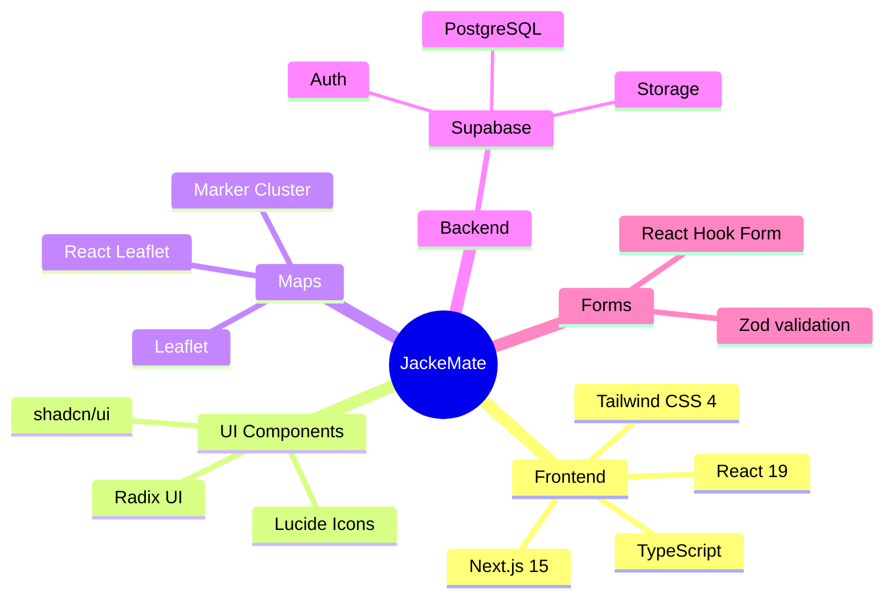

# 🧉 JackeMate

<div align="center">

**Plataforma ciudadana independiente para reportar problemas urbanos en Posadas**

[](https://jacke-mate.vercel.app/)
[](https://nextjs.org/)
[](https://supabase.com/)
[](https://www.typescriptlang.org/)
[](https://tailwindcss.com/)

🔗 **[Ver Demo en Vivo](https://jacke-mate.vercel.app/)**

</div>

---

## 📋 Descripción

JackeMate es una plataforma web creada **por vecinos, para vecinos**. Permite a los ciudadanos de Posadas reportar problemas urbanos (baches, luminarias rotas, basura, etc.) y visualizarlos en un mapa interactivo. Sin intermediarios políticos, con total transparencia.

### ✨ Características Principales

- 🗺️ **Mapa Interactivo** - Visualización geolocalizada de todos los reportes
- 📝 **Sistema de Reportes** - Creación con fotos, categorías y prioridades
- 🏆 **Gamificación** - Sistema de puntos y ranking de colaboradores
- 🔐 **Autenticación** - Login con email/contraseña y Google OAuth
- 👤 **Roles de Usuario** - Admin, Ciudadano e Interesado
- 📱 **Diseño Responsivo** - Optimizado para móvil y desktop

---

## 🏗️ Arquitectura



---

## 📁 Estructura del Proyecto

```
JackeMate/
├── app/                      # App Router de Next.js
│   ├── api/                  # API Routes
│   │   ├── reportes/         # API de paginación de reportes
│   │   └── send-notification/
│   ├── auth/                 # Páginas de autenticación
│   ├── dashboard/            # Dashboard del usuario
│   ├── mapa/                 # Mapa interactivo con Leaflet
│   ├── reportes/             # CRUD de reportes
│   │   ├── [id]/             # Detalle de reporte
│   │   └── nuevo/            # Crear nuevo reporte
│   └── page.tsx              # Página principal
├── components/               # Componentes reutilizables
│   ├── ui/                   # Componentes de UI (shadcn/ui)
│   ├── filtros-reportes.tsx  # Filtros con debounce
│   ├── leaflet-map.tsx       # Mapa con clusters
│   ├── lista-reportes-client.tsx  # Lista con paginación
│   └── report-card.tsx       # Tarjeta de reporte
├── database/
│   └── queries/              # Queries de Supabase organizadas
│       ├── admin/            # Queries administrativas
│       ├── reportes/         # CRUD de reportes
│       └── puntos.ts         # Sistema de puntuación
├── hooks/                    # Custom hooks
├── lib/                      # Utilidades
└── utils/
    └── supabase/             # Cliente Supabase (client/server)
```

---

## 🔄 Flujo de Datos



---

## 🔐 Sistema de Roles

| Rol | ID | Permisos |
|-----|:--:|----------|
| **Admin** | 1 | Acceso total, gestión de usuarios, cambiar estados |
| **Ciudadano** | 2 | Crear y gestionar sus propios reportes |
| **Interesado** | 3 | Solo visualización de mapa y reportes |

---

## 🚀 Instalación

### Prerrequisitos

- Node.js 18+
- npm o pnpm
- Cuenta en Supabase

### Pasos

1. **Clonar el repositorio**
   ```bash
   git clone https://github.com/Facudominguez7/JackeMate.git
   cd JackeMate
   ```

2. **Instalar dependencias**
   ```bash
   npm install
   ```

3. **Configurar variables de entorno**
   ```bash
   cp .env.example .env
   ```
   Editar `.env` con tus credenciales de Supabase:
   ```env
   NEXT_PUBLIC_SUPABASE_URL=tu_url
   NEXT_PUBLIC_SUPABASE_ANON_KEY=tu_anon_key
   ```

4. **Iniciar servidor de desarrollo**
   ```bash
   npm run dev
   ```

5. Abrir [http://localhost:3000](http://localhost:3000)

---

## 📦 Tecnologías Utilizadas



---

## 🎮 Sistema de Puntos

Los usuarios ganan puntos por contribuir a la comunidad:

| Acción | Puntos |
|--------|:------:|
| Crear reporte | +10 |
| Reporte marcado como reparado | +25 |
| Votar "no existe" (validado) | +5 |

---

## 🤝 Contribuir

1. Fork del repositorio
2. Crear rama feature: `git checkout -b feature/nueva-funcionalidad`
3. Commit cambios: `git commit -m 'feat: agregar nueva funcionalidad'`
4. Push a la rama: `git push origin feature/nueva-funcionalidad`
5. Crear Pull Request

---

## 📄 Licencia

Este proyecto es una iniciativa ciudadana independiente sin afiliación gubernamental.

---

<div align="center">

**Hecho con ❤️ por y para la comunidad posadeña**

</div>
