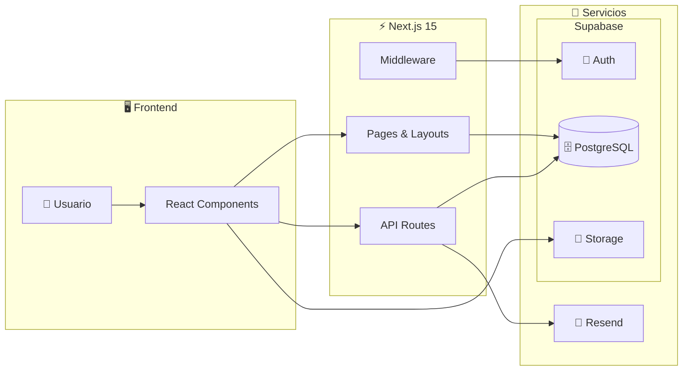
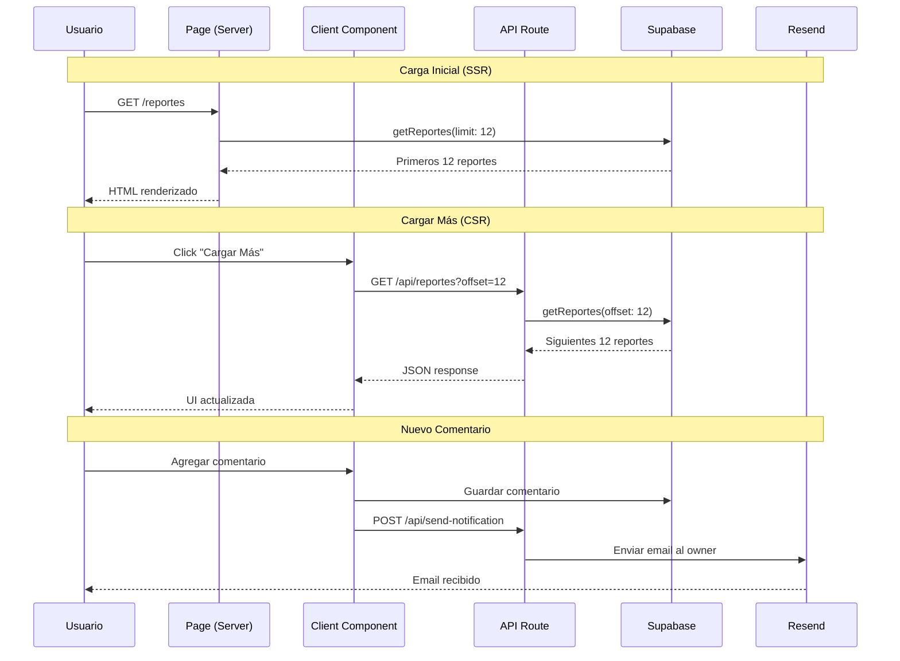

# 🧉 JackeMate

<div align="center">

**Plataforma ciudadana independiente para reportar problemas urbanos en Posadas**

[](https://jacke-mate.vercel.app/)
[](https://nextjs.org/)
[](https://supabase.com/)
[](https://www.typescriptlang.org/)
[](https://tailwindcss.com/)

🔗 **[Ver Demo en Vivo](https://jacke-mate.vercel.app/)**

</div>

---

## 📋 Descripción

JackeMate es una plataforma web creada **por vecinos, para vecinos**. Permite a los ciudadanos de Posadas reportar problemas urbanos (baches, luminarias rotas, basura, etc.) y visualizarlos en un mapa interactivo. Sin intermediarios políticos, con total transparencia.

### ✨ Características Principales

- 🗺️ **Mapa Interactivo** - Visualización geolocalizada con clustering de reportes
- 📝 **Sistema de Reportes** - Creación con fotos, categorías y prioridades
- 💬 **Comentarios** - Sistema de discusión en cada reporte
- 🗳️ **Votación** - Votar reportes como "no existe" o "reparado"
- 🏆 **Gamificación** - Sistema de puntos y ranking de colaboradores
- 📊 **Dashboard Analytics** - Mapa de calor, gráficos y estadísticas
- 📧 **Notificaciones por Email** - Alertas de comentarios y cambios de estado
- 🔐 **Autenticación** - Login con email y contraseña
- 👤 **Roles de Usuario** - Admin, Ciudadano e Interesado
- 🌙 **Tema Oscuro** - Soporte completo para modo oscuro
- 📱 **Diseño Responsivo** - Optimizado para móvil y desktop

---

## 🏗️ Arquitectura



**Flujo principal:**
1. El **Usuario** interactúa con los **React Components**
2. Los componentes se comunican con **Pages** (SSR) o **API Routes** (cliente)
3. Next.js consulta **PostgreSQL** para datos y **Storage** para imágenes
4. Las **API Routes** envían emails via **Resend** cuando corresponde
5. El **Middleware** valida sesiones con **Supabase Auth**

---

## 📁 Estructura del Proyecto

```
JackeMate/
├── app/                          # App Router de Next.js
│   ├── api/                      # API Routes
│   │   ├── reportes/             # Paginación de reportes
│   │   ├── send-notification/    # Notificación por nuevo comentario
│   │   └── send-status-notification/  # Notificación por cambio de estado
│   ├── auth/                     # Páginas de autenticación
│   │   ├── confirm/              # Confirmación de email
│   │   └── page.tsx              # Login/Registro
│   ├── dashboard/                # Dashboard del usuario
│   ├── mapa/                     # Mapa interactivo con Leaflet
│   ├── reportes/                 # CRUD de reportes
│   │   ├── [id]/                 # Detalle de reporte
│   │   └── nuevo/                # Crear nuevo reporte
│   └── page.tsx                  # Página principal
├── components/                   # Componentes reutilizables
│   ├── dashboard/                # Componentes de dashboard
│   │   ├── grafico-categorias.tsx    # Gráfico de reportes por categoría
│   │   ├── lista-zonas-calientes.tsx # Lista de zonas con más reportes
│   │   ├── mapa-calor-zonas.tsx      # Mapa de calor interactivo
│   │   └── metric-card.tsx           # Tarjetas de métricas
│   ├── ui/                       # Componentes de UI (shadcn/ui)
│   ├── filtros-reportes.tsx      # Filtros con debounce
│   ├── leaflet-map.tsx           # Mapa con clusters
│   ├── lista-reportes-client.tsx # Lista con paginación
│   └── report-card.tsx           # Tarjeta de reporte
├── database/
│   └── queries/                  # Queries de Supabase organizadas
│       ├── admin/                # Queries administrativas
│       │   ├── cambiar-estado-reporte.ts
│       │   ├── eliminar-comentario-admin.ts
│       │   └── eliminar-reporte-admin.ts
│       ├── interesado/           # Estadísticas para rol Interesado
│       ├── reportes/             # CRUD de reportes
│       │   ├── [id]/             # Detalle, votos, comentarios
│       │   └── nuevo/            # Crear reporte, subir imágenes
│       ├── puntos.ts             # Sistema de puntuación
│       └── estadisticas.ts       # Estadísticas generales
├── hooks/                        # Custom hooks
│   └── use-mobile.ts             # Detección de dispositivo móvil
├── lib/                          # Utilidades
└── utils/
    └── supabase/                 # Cliente Supabase (client/server/middleware)
```

---

## 🔄 Flujo de Datos



---

## 🔐 Sistema de Roles

| Rol | ID | Permisos |
|-----|:--:|----------|
| **Admin** | 1 | Acceso total, gestión de usuarios, cambiar estados, eliminar reportes/comentarios, acceso a analytics |
| **Ciudadano** | 2 | Crear y gestionar sus propios reportes, comentar, votar |
| **Interesado** | 3 | Visualización de mapa y reportes, **acceso a dashboard de analytics** |

---

## 🚀 Instalación

### Prerrequisitos

- Node.js 18+
- npm o pnpm
- Cuenta en Supabase
- Cuenta en Resend (para emails)

### Pasos

1. **Clonar el repositorio**
   ```bash
   git clone https://github.com/Facudominguez7/JackeMate.git
   cd JackeMate
   ```

2. **Instalar dependencias**
   ```bash
   npm install
   ```

3. **Configurar variables de entorno**
   ```bash
   cp .env.example .env
   ```
   Editar `.env` con tus credenciales:
   ```env
   NEXT_PUBLIC_SUPABASE_URL=tu_url
   NEXT_PUBLIC_SUPABASE_ANON_KEY=tu_anon_key
   RESEND_API_KEY=tu_resend_api_key
   NEXT_PUBLIC_APP_URL=http://localhost:3000
   ```

4. **Iniciar servidor de desarrollo**
   ```bash
   npm run dev
   ```

5. Abrir [http://localhost:3000](http://localhost:3000)

---

## 📦 Tecnologías Utilizadas

| Categoría | Tecnologías |
|-----------|-------------|
| **Frontend** | Next.js 15, React 19, TypeScript, Tailwind CSS 4 |
| **UI Components** | shadcn/ui, Radix UI, Lucide Icons |
| **Mapas** | Leaflet, React Leaflet, Marker Cluster |
| **Gráficos** | Recharts |
| **Backend** | Supabase (PostgreSQL, Auth, Storage) |
| **Email** | Resend |
| **Formularios** | React Hook Form, Zod |
| **Notificaciones** | Sonner (toasts) |
| **Tema** | next-themes (modo oscuro) |
| **Fechas** | date-fns, DayJS |

---

## 🎮 Sistema de Puntos

Los usuarios ganan (o pierden) puntos por sus acciones en la comunidad:

| Acción | Puntos |
|--------|:------:|
| Crear reporte | +10 |
| Comentar en un reporte | +2 |
| Votar "no existe" | +1 |
| Votar "reparado" | +1 |
| Tu reporte es marcado como reparado | +5 |
| Tu reporte es rechazado | -3 |
| Eliminar tu propio reporte | -10 |

---

## 📧 Sistema de Notificaciones

JackeMate envía notificaciones por email en los siguientes casos:

- **Nuevo comentario**: Cuando alguien comenta en tu reporte
- **Cambio de estado**: Cuando un administrador cambia el estado de tu reporte

Los emails son enviados mediante [Resend](https://resend.com) con plantillas HTML personalizadas.

---

## 🤝 Contribuir

1. Fork del repositorio
2. Crear rama feature: `git checkout -b feature/nueva-funcionalidad`
3. Commit cambios: `git commit -m 'feat: agregar nueva funcionalidad'`
4. Push a la rama: `git push origin feature/nueva-funcionalidad`
5. Crear Pull Request

---

## 📄 Licencia

Este proyecto es una iniciativa ciudadana independiente sin afiliación gubernamental.

---

<div align="center">

**Hecho con ❤️ por y para la comunidad posadeña**

</div>
